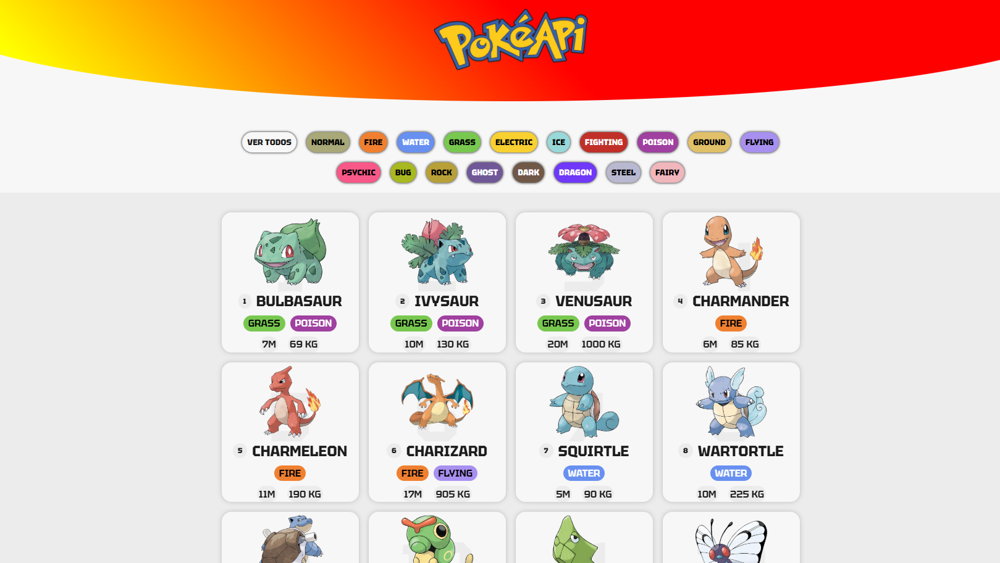

## Captura de Pantalla

# Pokedex API Proyecto

## Descripción del Proyecto

Este proyecto es una aplicación de Pokedex que utiliza la API de Pokémon para mostrar información sobre diferentes especies de Pokémon. La aplicación permite a los usuarios buscar y visualizar información sobre sus Pokémon favoritos.

## Funcionalidades

* Visualizar información detallada sobre cada Pokémon, incluyendo:
  * Nombre y descripción
  * Tipo y habilidades
* Mostrar imágenes de los Pokémon

## Tecnologías Utilizadas

* Lenguaje de programación: HTML, CSS, JAVASCRIPT
* API: Pokeapi

## Instalación y Uso

1. Clona el repositorio en tu máquina local.
2. Abre la aplicación en tu navegador favorito.

## Contribuciones

Si deseas contribuir a este proyecto, por favor sigue los siguientes pasos:

1. Haz un fork del repositorio en tu cuenta de GitHub.
2. Crea una nueva rama para tu contribución.
3. Realiza los cambios deseados y haz un commit con un mensaje claro.
4. Haz un pull request para que podamos revisar tus cambios.

## Licencia

Este proyecto está bajo la licencia MIT License. Por favor, lee la licencia antes de utilizar o distribuir el código.

## Agradecimientos

* A la comunidad de Pokémon por proporcionar la API y la información necesaria para este proyecto.
* A todos los contribuyentes que han ayudado a mejorar este proyecto.